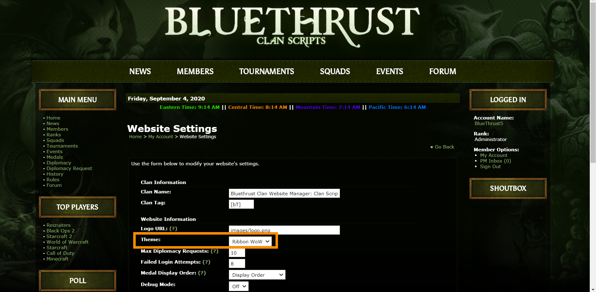
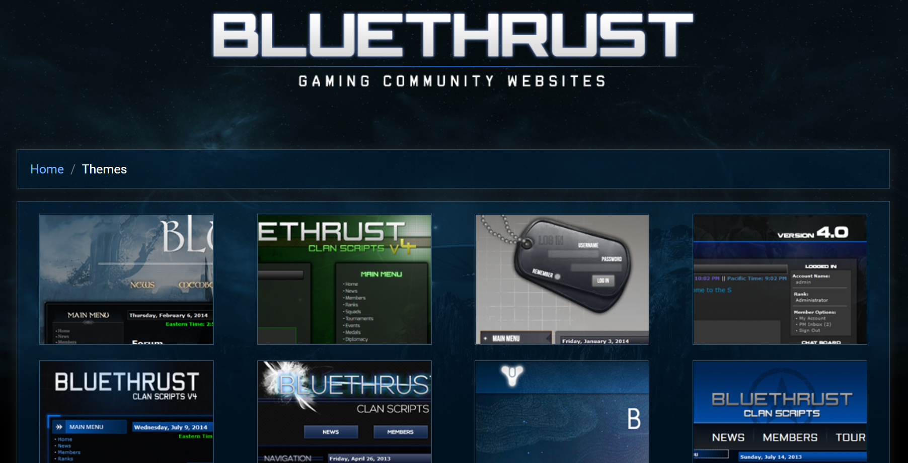

# BlueThrust Clan Scripts v5 Themes

## About

This repository contains website themes (skins) for the gaming community website engine, [BlueThrust Clan Scripts v5](https://github.com/RedDragonWebDesign/BlueThrust5). You need to have BlueThrust5 set up and running on a web server before these themes will work.

This repository contains 29 themes that can be added to the core.

I made this a separate repository because it is very big. It is 300MB. Folks can download the much smaller core, get that running with the default theme, then if they want they can add more themes from here.

I am not including Ribbon WoW here because that is the default theme in core. The files for Ribbon WoW can be found in the other repository.

## This is a fork of BlueThrust 4

BlueThrust5 is a fork of the abandonware project BlueThrust4. I am not the original creator of these themes. All themes were taken from [this page on the BlueThrust website](https://bluethrust.com/themes).

As I make code changes to BlueThrust5, I will make changes to these themes too, so that everything stays compatible.

## What do the themes look like?

You can browse [this page on the original author's website](https://bluethrust.com/themes) to see demos for all 29 themes.

## Setup Guide

1) Pick a theme you like

2) Download it. You just need that theme's folder.

3) Place the folder you just downloaded on your website, in the themes folder. For example, if you want the armygreen theme, download the armygreen folder, then put it in your BlueThrust5/themes folder, so that you now have BlueThrust5/themes/armygreen.

4) Log into your control panel on the website. Login -> My Account

5) Navigate to Administrator Options -> Website Settings

6) Under theme, the theme folder you just uploaded should show up in the list of drop down options. Select it. Hit save.

7) Enjoy your new theme!

## Bugs, Security Issues, Feature Requests

Please report all bugs, security issues, and feature requests.

Create a GitHub account, then [create an issue](https://github.com/RedDragonWebDesign/BlueThrust5-Themes).

## I am available for hire

Do you just want these scripts up and running? Not interested in the technical details? I'm available for hire. I can help with any/all of the following:

- Buying a domain name
- Buying web hosting
- Installing and configuring BlueThrust5
- Making custom modifications to BlueThrust5

[Click here](https://www.reddragonwebdesign.com/contact/) to send me an email.

## Screenshots

